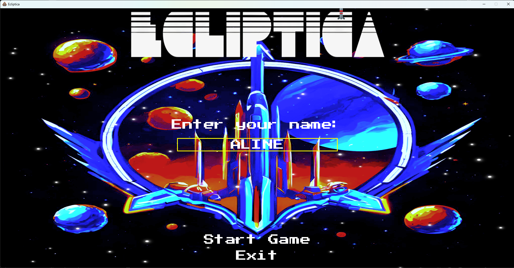
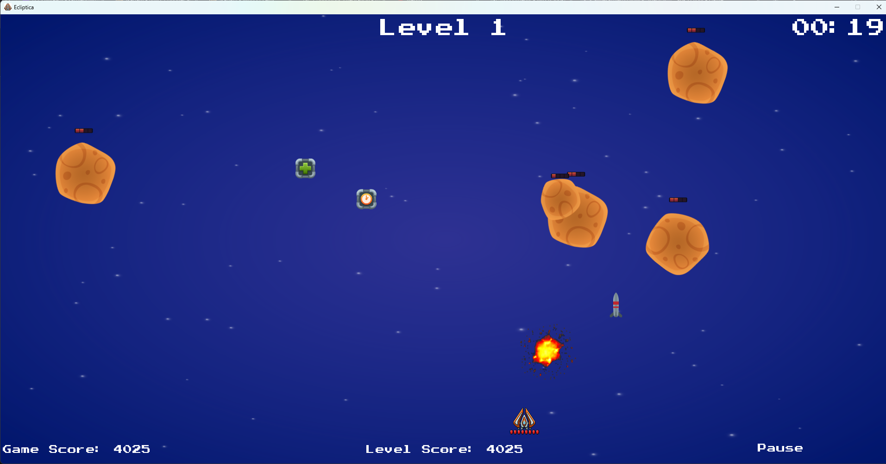
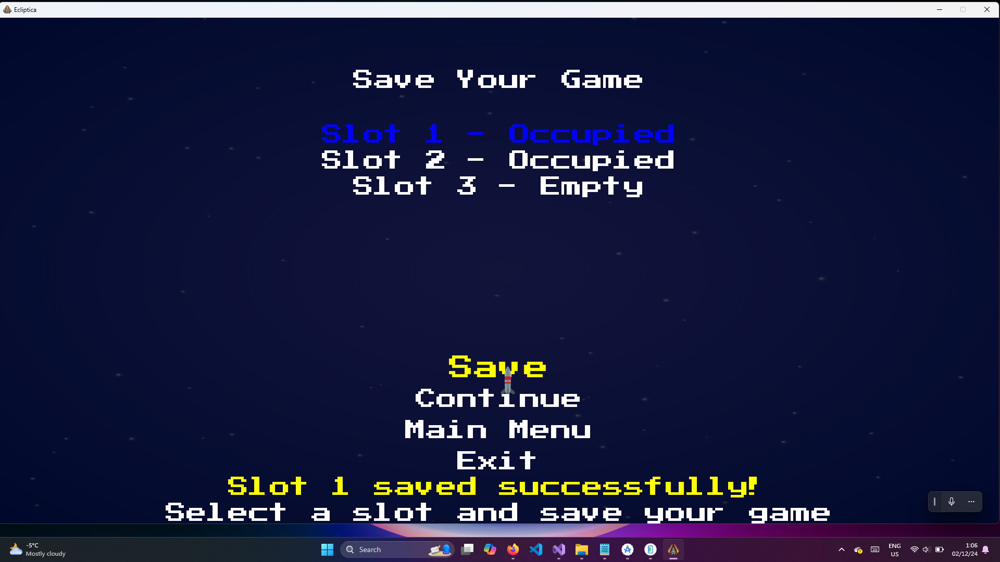
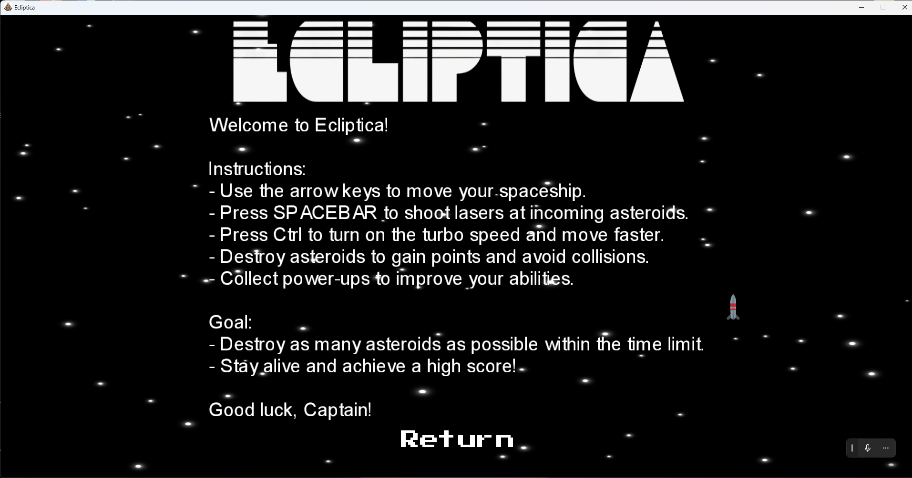

Ecliptica

A thrilling 2D space shooter adventure!

About the Game

Ecliptica is a fast-paced 2D space shooter developed as part of the PROG2370 - Game Programming with Data Structures course in the Computer Programming diploma program at Conestoga College.

In this game, players must destroy asteroids of different sizes and speeds within a limited time. The challenge increases as asteroids multiply and accelerate, testing your reflexes and precision.

Face epic space battles, unravel cosmic mysteries, and conquer the stars!

Features

Engaging 2D Space Shooter Gameplay - Dodge, shoot, and survive in a chaotic asteroid field.
Multiple Enemy Types - Asteroids of varying sizes and speeds keep the action unpredictable.
Dynamic Controls - Supports keyboard, mouse, and touch input for Windows & Android.
Save & Load System - Players can save and resume their progress.
Multiplatform Support - Runs on Windows and Android using MonoGame.
Polished UI & Graphics - Custom-designed visuals with a retro space theme.
Custom Soundtrack & Effects - Immersive sound effects and background music.

Screenshots

Tools & Technologies

Game Engine: MonoGame (Built on the Microsoft XNA Framework)
Development Environment: Visual Studio
Graphics & UI Design: Microsoft Designer
Programming Language: C#
Platform Support: Windows & Android

Installation & Setup

Windows (PC)
Download the latest installer from the Releases section of the repository.
Run the installer and follow the setup instructions.
Launch the game and start playing!

Alternatively, if you want to run the project from source:
Install MonoGame 3.8 if not already installed.
Clone the repository:
git clone https://github.com/alinesathler/Ecliptica.git
Open the solution (.sln) in Visual Studio.
Build & Run the project.

Android (Coming Soon)

Currently, an Android APK is not available for direct download.
If you want to test the game on Android, you can build the APK from source using MonoGame for Android:
Clone the repository:
git clone https://github.com/alinesathler/Ecliptica.git
Open the project in Visual Studio.
Switch the build target to Android.
Build the APK and install it manually on your device.

Controls

| Action          | Windows (Keyboard) | Android (Touch) |
|----------------|-------------------|----------------|
| Move Up       | `Up Arrow`    | Swipe Up      |
| Move Down     | `Down Arrow`  | Swipe Down    |
| Move Left     | `Left Arrow`  | Swipe Left    |
| Move Right    | `Right Arrow` | Swipe Right   |
| Shoot         | `Spacebar`    | Tap Screen    |
| Move faster   | `Ctrl`        | - |

Roadmap (Future Improvements)

Planned Enhancements:
Multiplayer Support - Implement online multiplayer with Photon or Lidgren.
Power-Ups & Upgrades - Add new weapons, shields, and abilities.
More Levels & Enemies - Introduce enemy ships, space stations, and boss fights.
Leaderboards & High Scores - Track top players with Firebase or PlayFab (today this is maid only locally).

License

This project is licensed under the MIT License  see the [LICENSE](LICENSE) file for details.
(Note: License Choice Explanation (MIT License)

I chose the MIT License for Ecliptica because it provides a balance between open-source collaboration and developer rights.
  - Open-Source Friendly: I want other developers to learn from, use, and modify my code without strict limitations. The MIT License allows anyone to fork, improve, and even use the game in their own projects, as long as they give proper credit.
  - Minimal Restrictions: Some licenses (like the GPL) require projects using my code to also be open-source. MIT does not have this requirement, meaning developers can use my code without being forced to make their projects open-source.
  - Simplicity & Accessibility: The MIT License is short and easy to understand, making it more accessible to developers without a legal background.
  - Attribution Requirement: While I’m allowing free use, the MIT License still requires users to credit me as the original author. This ensures that my work is acknowledged.
  - Flexibility for Future Use: If I want to expand or commercialize Ecliptica in the future, the MIT License doesn’t restrict me from doing so. Unlike more restrictive licenses, I can still retain full ownership of my project while allowing community contributions.)

Contact & Contributions

Developer: Aline Sathler
Email: sathler@ymail.com
GitHub Repository: Ecliptica

Contributions & Feedback:

Feel free to submit issues, pull requests, or suggest new features!
If you enjoy playing Ecliptica, don't forget to give this repository a star! ⭐
